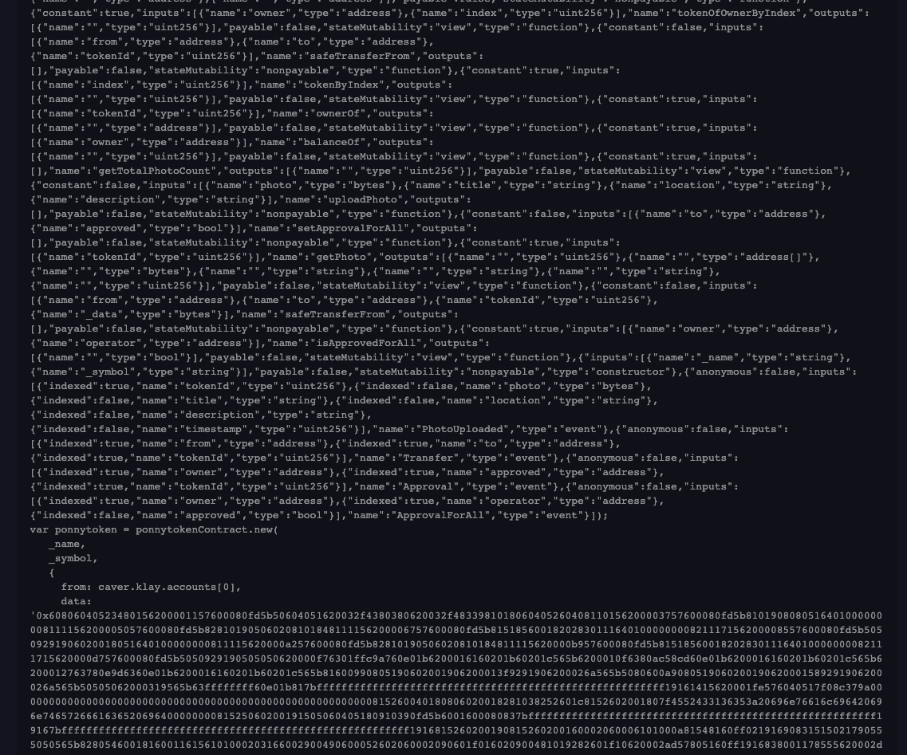

# Klaytn 발표 자료

### 공부의 목적
1. 클레이튼 기반의 개발을 하기 위해서는 무엇을 알고 해야하나?
2. NFT 개발을 하기 위해서는 무엇을 알고 해야하나?
3. KlaySwap에 대한 작동 로직 분석

### Klaytn이란?
* 클레이튼은 이더리움 오픈소스를 포크를 떠 카카오 GroundX에서 자체적으로 운영하고있는 블록체인 네트워크를 말합니다.
 
 

| 차이점 | 이더리움 | 클레이튼 |
|------|--------|------|
|1. 합의 알고리즘 및 성능| POS | PBFT |
|2. 노드 구성 | 모두 동일 | CN, PN, EN |
|3. 가스 비용 | 상대적으로 비쌈 | 상대적으로 가격이 쌈 |
|4. 개발을 위한 SDK | Web3.js | caver.js |

##### 합의 알고리즘
* POS(지분증명) 방식은 노드가 가진 지분을 기반으로 블록을 생성하는 노드를 결정하며, 블록의 유효성을 결정 할때 다른 노드들과 통신하지 않습니다. 
`문제점 : 포크 현상 발생 -> 가장 긴 노드가 만들어지기까지 블록 및 트랜잭션의 완결성을 보장 받을 수 없음` 
위 문제점을 해결 하기 위해 클레이튼에서는 PBFT라는 합의 알고리즘을 사용합니다. 
* 클레이튼의 성능
 
 
##### 노드 구성

1. CN (Consensus Node)
* 합의 알고리즘을 거쳐 새로운 블록을 생성하는 노드
2. PN (Proxy Node)
* 외부 네트워크와 CN을 연결하는 역할 
3. EN (Endpoint Node)
* 사용자로부터 RPC API 요청을 처리하고 Service Chain(BApp)과 데이터를 주고 받는 노드

### 클레이튼 SmartContract 프로그래밍 언어 Solidity
| 비교 | Kotlin | Solidity |
|-----|--------|----------|
| VM  | JVM | EVM |
| 컴파일 | 자바 바이트코드(.class) | abi(json) + EVM 바이트 코드(Op Code) | 
| tool | IntelliJ | Remix |
1. Klaytn IDE

2. ByteCode, ABI

